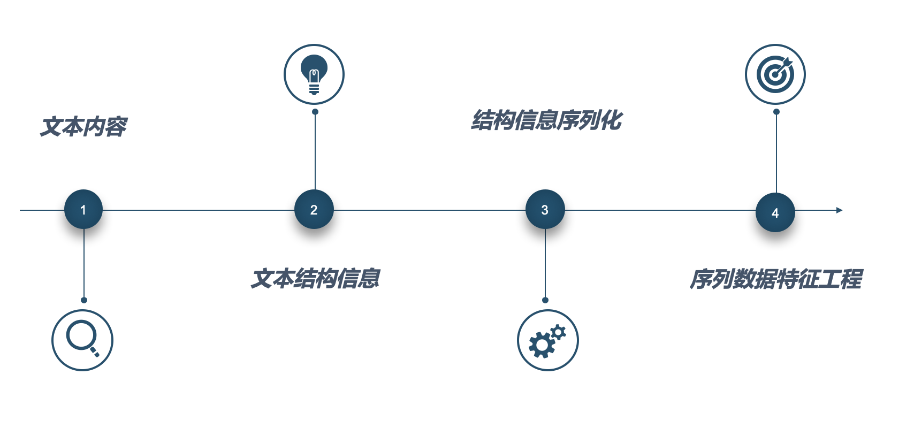
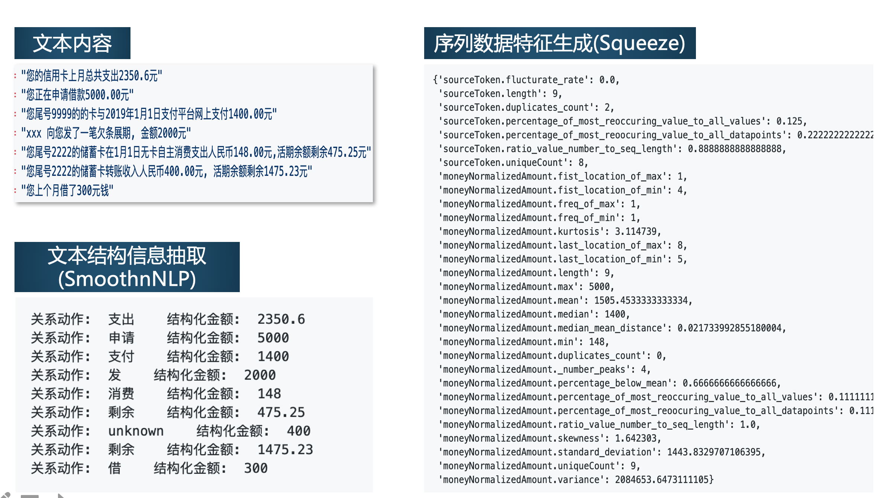

# Superb 
> 一套文本数据的建模方案

## SmoothNLP
> NLP文本处理与结构化信息抽取
* 传统NLP文本处理功能
   - 切词, 词性标注, 句法分析, 情感识别
* 无监督学习
   - PMI, Left&Right Entropy (词义独立性统计指标)
   - Keyword TextRank (关键词学习)
   - Sentence TextRank (文本摘要)
   - Integrated NER (综合类别实体识别)
       - Money **金额**
       - Date 日期
       - Number 数字
       - Location 位置

## seq2ftr 
> 一款支持对于序列结构化信息自动生成特征的产品。
### 特点：
1. 高性能、完成度较高、相对于目前较火的*tsfresh*, seq2ftr无外部依赖，原生实现
2. 支持不同数据类型的特征计算（数值型、类别型、布尔型）
3. 特征支持类型多样，且扩展方便 
5. 与smoothNLP结果可以无缝衔接 (基于基础文本task, 生成可解释的9条)
5. 目前开发进度, (单序列特征生成):
   * 数值型变量: 31条特征
   * 分类型变量: 9条

## 示例功能演示
文本内容 -> 信息结构化 -> 序列数据特征工程

